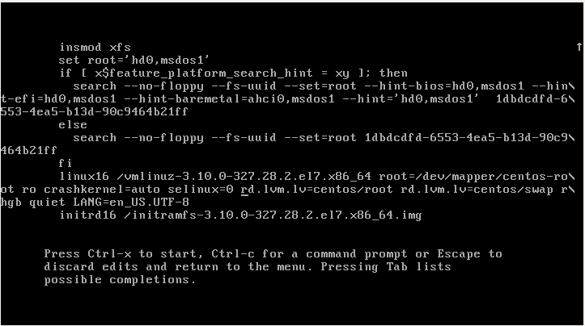
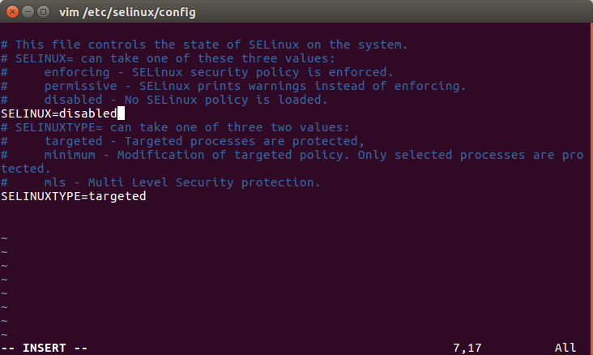

# issue

1.**boot start** -->failed to load selinux policy freezing   
[solve:](https://asafshoval.wordpress.com/2014/11/18/overcome-fail-to-load-selinux-policy-freezing-error-message-while-booting-linux/)
```shell
    on the boot menu, edit the boot configuration and add “selinux=0” to the boot command
```
　　　　　　　　　　　　　　　　
上述每次启动都需要修改，下面对setlinux 配置忽略加载　selinux policy.
```shell
vim /etc/selinux/config 
SELINUX=enforcing-->SELINUX=disabled

```

                               
